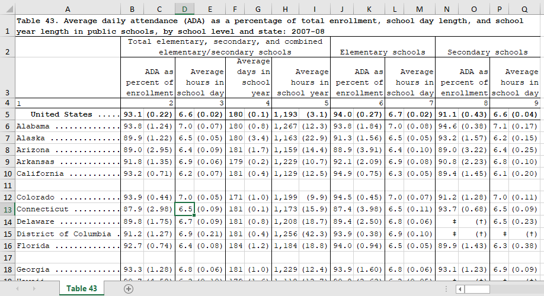

# Cleaning Data in R, Average daily attendance \(ADA\) USA



All images, data and R Script can be found [here](https://github.com/vuduong191/Gitbook/tree/master/resources/R01)

A lot of times, we have to import data from Excel and make it ready for analysis. Very often, the cleaning step takes a lot more time than the analysis itself. The data structure in Excel with high level of complexity is very helpful for reading the spreadsheet, but it makes life harder when it comes to cleaning and organizing. This short case is a good practice to get myself familiar to this kind of problem.

## Import Data

```r
> att <- read_xls("attendance.xls")
> head(att,n=15)
# A tibble: 15 x 17
   `Table 43. Average d~ X__1       X__2 X__3      X__4 X__5     X__6 X__7    X__8 X__9    X__10 X__11    X__12 X__13  X__14 X__15 X__16
   <chr>                 <chr>     <dbl> <chr>    <dbl> <chr>   <dbl> <chr>  <dbl> <chr>   <dbl> <chr>    <dbl> <chr>  <chr> <chr> <chr>
 1 NA                    Total e~ NA     NA     NA      NA     NA     NA     NA    Eleme~ NA     NA     NA      Secon~ NA    NA    NA   
 2 NA                    ADA as ~ NA     Avera~ NA      Avera~ NA     Avera~ NA    ADA a~ NA     Avera~ NA      ADA a~ NA    Aver~ NA   
 3 1                     2        NA     3      NA      4      NA     5      NA    6      NA     7      NA      8      NA    9     NA   
 4 United States ......~ 93.0789~  0.219 6.644~  0.0176 180     0.143 1192.~  3.09 94.00~  0.269 6.656~  0.0160 91.11~ 0.43~ 6.59~ 0.04~
 5 Alabama ............~ 93.8123~  1.24  7.028~  0.0656 180     0.755 1266.~ 12.3  93.77~  1.84  7.038~  0.0759 94.56~ 0.37~ 7.13~ 0.17~
 6 Alaska .............~ 89.9175~  1.22  6.476~  0.0499 180     3.43  1162.~ 22.9  91.28~  1.56  6.486~  0.0531 93.24~ 1.57~ 6.24~ 0.14~
 7 Arizona ............~ 89.0369~  2.95  6.433~  0.0919 181     1.68  1159.~ 14.4  88.90~  3.91  6.443~  0.102  88.97~ 3.22~ 6.36~ 0.24~
 8 Arkansas ...........~ 91.8271~  1.35  6.885~  0.0615 179     0.202 1228.~ 10.7  92.09~  2.09  6.932~  0.0765 90.81~ 2.23~ 6.76~ 0.09~
 9 California .........~ 93.2410~  0.712 6.240~  0.0664 181     0.439 1128.~ 12.5  94.93~  0.754 6.289~  0.0515 89.36~ 1.44~ 6.14~ 0.20~
10 NA                    NA       NA     NA     NA      NA     NA     NA     NA    NA     NA     NA     NA      NA     NA    NA    NA   
11 Colorado ...........~ 93.8871~  0.440 7.007~  0.0520 171     1.05  1199.~  9.92 94.53~  0.447 6.960~  0.0664 91.24~ 1.28~ 7.00~ 0.10~
12 Connecticut ........~ 87.9258~  2.98  6.466~  0.0878 181     0.138 1173.~ 15.9  87.37~  3.98  6.469~  0.112  93.74~ 0.68~ 6.46~ 0.09~
13 Delaware ...........~ 89.7705~  1.75  6.678~  0.0896 181     0.832 1208.~ 18.7  89.36~  2.50  6.766~  0.0606 ‡      (†)   6.54~ 0.22~
14 District of Columbia~ 91.2208~  1.27  6.913~  0.214  181     0.438 1255.~ 42.3  93.93~  0.379 6.916~  0.0969 ‡      (†)   ‡     (†)  
15 Florida ............~ 92.6781~  0.741 6.427~  0.0841 184     1.20  1183.~ 18.8  93.96~  0.936 6.463~  0.0550 89.90~ 1.42~ 6.31~ 0.37~
> tail(att,n=10)
# A tibble: 10 x 17
   `Table 43. Average dai~ X__1     X__2 X__3      X__4 X__5    X__6 X__7    X__8 X__9    X__10 X__11    X__12 X__13  X__14  X__15 X__16
   <chr>                   <chr>   <dbl> <chr>    <dbl> <chr>  <dbl> <chr>  <dbl> <chr>   <dbl> <chr>    <dbl> <chr>  <chr>  <chr> <chr>
 1 Vermont ..............~ 92.72~  3.39  6.656~  0.0740 177    0.457 1179.~ 13.6  93.08~  4.50  6.716~  0.0904 90.77~ 4.080~ 6.40~ 0.17~
 2 Virginia .............~ 94.67~  0.460 6.617~  0.0502 181    0.159 1197.~  9.10 95.59~  0.350 6.611~  0.0327 93.94~ 0.584~ 6.67~ 0.18~
 3 Washington ...........~ 82.85~  3.06  6.222~  0.0804 179    0.174 1116.~ 14.5  81.04~  4.42  6.378~  0.0452 85.76~ 2.753~ 5.89~ 0.26~
 4 West Virginia ........~ 94.00~  0.988 6.873~  0.0701 182    0.498 1251.~ 13.7  94.37~  1.32  6.879~  0.0932 92.84~ 0.408~ 6.82~ 0.13~
 5 Wisconsin ............~ 94.95~  0.566 6.911~  0.0427 180    0.736 1246.~  8.63 95.37~  0.415 6.886~  0.0485 93.01~ 1.907~ 7.01~ 0.14~
 6 Wyoming ..............~ 92.35~  1.15  6.858~  0.0458 175    1.28  1200.~  8.33 92.19~  1.65  6.850~  0.0547 92.38~ 0.749~ 6.97~ 0.06~
 7 †Not applicable.        NA     NA     NA     NA      NA    NA     NA     NA    NA     NA     NA     NA      NA     NA     NA    NA   
 8 ‡Reporting standards n~ NA     NA     NA     NA      NA    NA     NA     NA    NA     NA     NA     NA      NA     NA     NA    NA   
 9 NOTE: Averages reflect~ NA     NA     NA     NA      NA    NA     NA     NA    NA     NA     NA     NA      NA     NA     NA    NA   
10 "SOURCE: U.S. Departme~ NA     NA     NA     NA      NA    NA     NA     NA    NA     NA     NA     NA      NA     NA     NA    NA
```

When you're importing a messy spreadsheet into R, it's good practice to compare the original spreadsheet with what you've imported. By comparing with the screenshot, I have these observations:

* The data is surely messy
* read\_xls\(\) function actually imported the first row of the original data frame as the variable name, and that's not what you want in this case
* The names of variables have to be added manually
* Many rows and columns contain useless or missing data

## Cleaning

I first removed rows with NA values, and columns with useless data. I also assigned names to varibles.

```r
> #Remove rows with more than 5 NA values
> #Remove columns 3,5,7,9,11,13,15,17. They contains useless data
> nacount <- is.na(att)
> removerow<-rowSums(nacount)>5
> removecolumn <-seq(3,17,2)
> att2 <- att[!removerow,-removecolumn]
> # Define cnames vector
> cnames <- c("state", "avg_attend_pct", "avg_hr_per_day", "avg_day_per_yr", "avg_hr_per_yr","avg_attend_pct", "avg_hr_per_day", "avg_attend_pct", "avg_hr_per_day")
> # Assign column names of att2
> colnames(att2) <- cnames
> head(att2)
# A tibble: 6 x 9
  state      avg_attend_pct  avg_hr_per_day  avg_day_per_yr avg_hr_per_yr   avg_attend_pct  avg_hr_per_day avg_attend_pct avg_hr_per_day
  <chr>      <chr>           <chr>           <chr>          <chr>           <chr>           <chr>          <chr>          <chr>         
1 United St~ 93.07896200000~ 6.644700000000~ 180            1192.647200000~ 94.00498299999~ 6.65605600000~ 91.1180810000~ 6.59439400000~
2 Alabama .~ 93.81237099999~ 7.028520000000~ 180            1266.6205       93.77637500000~ 7.03847299999~ 94.5610010000~ 7.13723900000~
3 Alaska ..~ 89.91759700000~ 6.476880000000~ 180            1162.9084       91.281537       6.48678500000~ 93.240876      6.24086500000~
4 Arizona .~ 89.03696100000~ 6.433690000000~ 181            1159.114399999~ 88.90439299999~ 6.443155       88.9797159999~ 6.36909200000~
5 Arkansas ~ 91.82711100000~ 6.885419999999~ 179            1228.888099999~ 92.09320099999~ 6.93215999999~ 90.8119520000~ 6.76750800000~
6 Californi~ 93.24101699999~ 6.24064         181            1128.769399999~ 94.931421       6.28974499999~ 89.3608569999~ 6.14261500000~
```

I also noticed that state names are all stored as the same number of characters, with periods padding the ends of the shorter states. This technique is helpful in many cases, but here, we need to get rid of it by removing all dot \(.\) in the state names.

```r
> att2$state<-str_replace_all(att2$state,"\\.","")
> att2$state <-str_trim(att2$state)
> head(att2$state)
[1] "United States" "Alabama"       "Alaska"        "Arizona"       "Arkansas"      "California"
```

Make sure you apply names before you run str\_replace\_all function, because if you call str\_replace\_all on att2\[1\], instead of att2$state, things will be messy. att2\[1\] is a dataframe, while att2$state is a vector.

In many cases, a single data frame stores multiple "tables" of information. In this data frame, columns 1, 6, and 7 represent attendance data for US elementary schools, columns 1, 8, and 9 represent data for secondary schools, and columns 1 through 5 represent data for all schools in the US.

Each of these should be stored as its own separate data frame, so I split them up here.

```r
# Subset just elementary schools: att_elem
att_elem <- att2[,c(1,6,7)]

# Subset just secondary schools: att_sec
att_sec <- att2[,c(1,8,9)]

# Subset all schools: att4
att4 <- att2[,1:5]
```

It's also noticeable that numerical data has come in as character strings. I can think of two ways to coerce strings into numbers.

```r
> att4 <- mutate_at(att4, vars(-state), funs(as.numeric))
> str(att4)
Classes ‘tbl_df’, ‘tbl’ and 'data.frame':    52 obs. of  5 variables:
 $ state         : chr  "United States" "Alabama" "Alaska" "Arizona" ...
 $ avg_attend_pct: num  93.1 93.8 89.9 89 91.8 ...
 $ avg_hr_per_day: num  6.64 7.03 6.48 6.43 6.89 ...
 $ avg_day_per_yr: num  180 180 180 181 179 181 171 181 181 181 ...
 $ avg_hr_per_yr : num  1193 1267 1163 1159 1229 ...
> # You can actually use sapply to do this
> # cols<-c(2:ncol(att4))
> # att5[, cols] <- sapply(att4[,cols],as.numeric)
```

And now the data is good for analysis.

