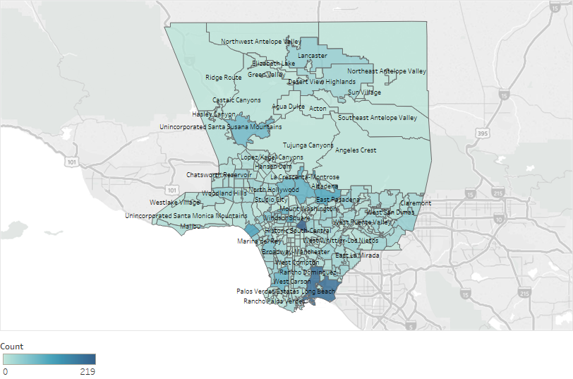
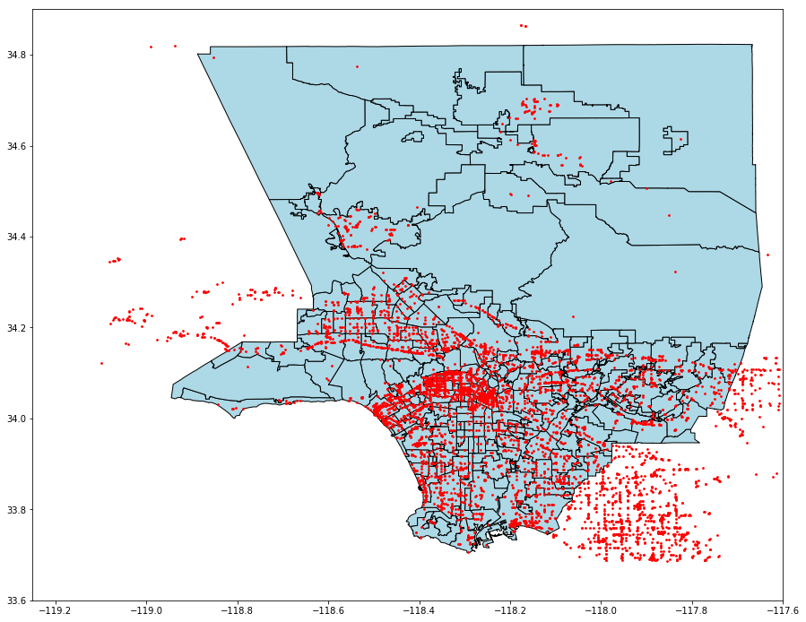
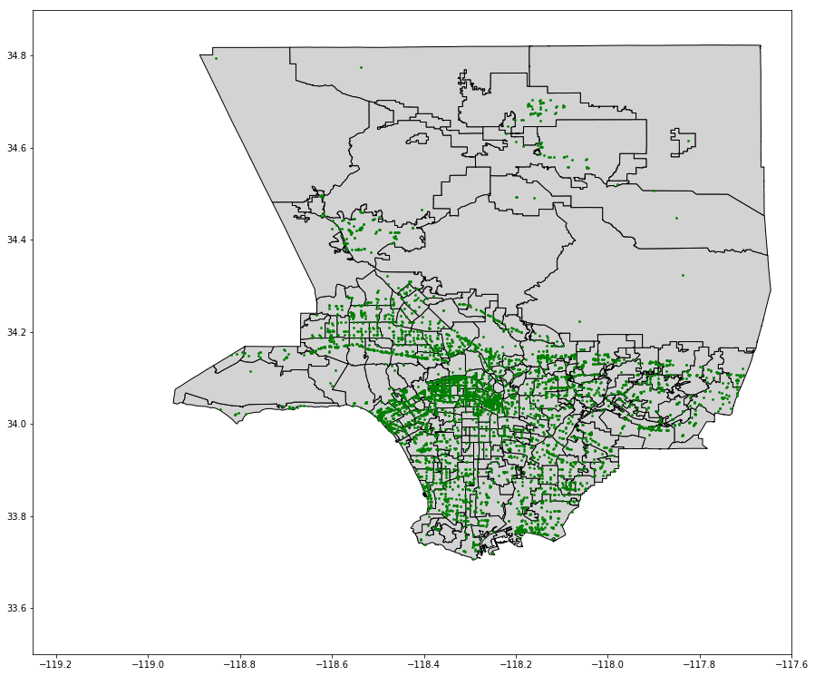

# Complete Data Set on Coffee Shop Footprints in Los Angeles County

The data set can be found [here](../resources/Yelp01/data), you can also find a shape file for easy visualization on Tableau. Note: the data set was acquired in April 2019.

An example of usage of the shape file in Tableau:


#### Yelp Fusion API

The Yelp Fusion API allows you to get the best local content and user reviews from millions of businesses across 32 countries. To get the  listings in a geographical area, we need to use Business Search endpoint, which allows search for businesses by keyword, category, location, price level, etc.

The response is in Json format, something like this:

```text
{
  "total": 8228,
  "businesses": [
    {
      "rating": 4,
      "price": "$",
      "phone": "+14152520800",
      "id": "E8RJkjfdcwgtyoPMjQ_Olg",
      "alias": "four-barrel-coffee-san-francisco",
      "is_closed": false,
      "categories": [
        {
          "alias": "coffee",
          "title": "Coffee & Tea"
        }
      ],
      "review_count": 1738,
      "name": "Four Barrel Coffee",
      "url": "https://www.yelp.com/biz/four-barrel-coffee-san-francisco",
      "coordinates": {
        "latitude": 37.7670169511878,
        "longitude": -122.42184275
      },
      "image_url": "http://s3-media2.fl.yelpcdn.com/bphoto/MmgtASP3l_t4tPCL1iAsCg/o.jpg",
      "location": {
        "city": "San Francisco",
        "country": "US",
        "address2": "",
        "address3": "",
        "state": "CA",
        "address1": "375 Valencia St",
        "zip_code": "94103"
      },
      "distance": 1604.23,
      "transactions": ["pickup", "delivery"]
    },
    // ...
  ],
  "region": {
    "center": {
      "latitude": 37.767413217936834,
      "longitude": -122.42820739746094
    }
  }
}
```

**The Problem**

A request call can only return maximum 50 businesses. By adjusting the "offset" parameter, we can get up to 1000 businesses using multiple calls. But 1000 is not enough. Imagine if you search for coffee shops in a city or zip code, there can be more than 1000 records. In the example above, there are 8228 businesses satisfying the search filters, and with this limit, you cannot acquire information for all of them.

**Solution**

I will overlay a grid-line on top of the LA County map, and pick the coordinates \(latitude, longitude\) of intersections and use these as location parameters in the API request. I make sure the grid is fine enough so any two nearby intersections are less than 1 mile away. Then I will find make API requests to find all the coffee shops around each of these points. I made the radius parameter = 1700 meters \(larger than 1 mile\) to guarantee no coffee shop is missed out.


There are 10432 points in this grid, you have to use multiple API Keys to complete the task in one day because the free version allows maximum 5000 requests a day. The code can be found here.

After making 10432 requests, I get maximum 50 coffee shops located around each point. The most crowded area has about 500 coffee shops \(fewer than 1000, so we are relieved that we can catch them all\). 

The next step is to pick out the coordinates, around which there are more than 50 coffee shops. I save this list as "latlongover50.csv". It looks like this:

```text
	index	lat	long	Count	no_of_queries
0	35	33.705431	-118.002873	62	2
1	36	33.705431	-117.989117	57	2
2	37	33.705431	-117.975362	53	2
3	38	33.705431	-117.961606	84	2
4	39	33.705431	-117.947851	67	2
```

For example, for coordinates having 62 coffee shops, I need to make 2 requests. The first request has been made. I will use "offset" parameter to get the rest. Because we have limit=50, that means we got coffee shops 1-50 in the loop above, so give it offset=51 and we will get 51-62. The same thought process applies for a higher number of count. The code can be found here.

At this point, I have thousands of Json files returned from all requests made above. I need to make a data frame out of each file, join them, and remove duplicates. When a json file is loaded using json.load(), the result's class type is "dict". To construct DataFrame from dict, I use classmethod DataFrame.from_dict.

```python
for file in os.listdir("./"):
        print(file)
        try:
            with open(file) as json_file:  
                response = json.load(json_file)
            df = pd.DataFrame.from_dict(response['businesses'])
            alldata=pd.concat([alldata,df], ignore_index=True)
        except Exception:
            pass
```
In this step I also do some cleaning activities. For example, cleaning the 'categories' str:

From this:
```python
"[{'alias': 'coffeeroasteries', 'title': 'Coffee Roasteries'}, {'alias': 'coffee', 'title': 'Coffee & Tea'}, {'alias': 'breakfast_brunch', 'title': 'Breakfast & Brunch'}]"
```
To this:
```python
"['coffeeroasteries', 'coffee', 'breakfast_brunch']"
```
I also remove foodtrucks and businesses that do not sell coffee (not having any category related to coffee). The data achieved from this step can be found here, "AllCoffeeFinalApril.csv"

#### AirBnB GeoJson 

The coffee shops we found above include one that are outside of LA County, I use AirBnB GeoJSON file of neighbourhoods to pick only the one inside the borders. I also assign a neighborhood name to each coffee shop, which is very useful for further analysis. The GeoJSON file is available [here](http://insideairbnb.com/get-the-data.html).




Looking at this visualization, it's apparent that many coffee shops do not belong to LA County. I need to get rids of them by joining the data set with the GeoJSON file.



This is what I have then. Details can be found [here](../resources/Yelp01/script), "Merge with Airbnb GeoJson.ipynb"