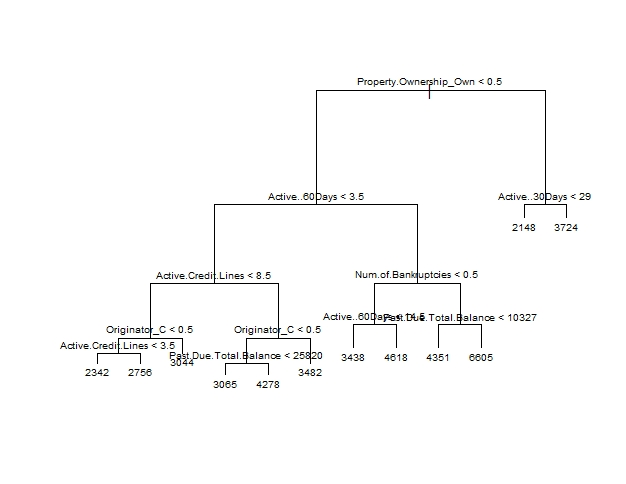
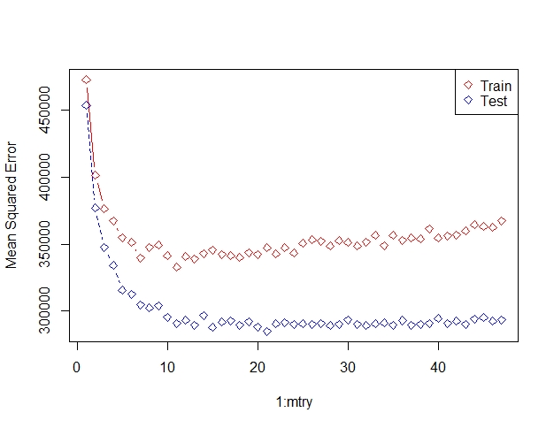

# Decision Tree Ensembles in R


_This image may not relate to this project at all. Source: www.paisabazaar.com All images, data and R Script can be found [here](https://github.com/vuduong191/Gitbook/tree/master/resources/DT01)_

Decision Tree has been around for a long time and also known to suffer from bias and variance. Ensemble methods, which combines several trees, are among the most popular solutions. We will try various methods such as bagging, random forest, and boosting in this example.

## Prompt

You are hired to help a finance company identify profitable customers. Its clients are small businesses that purchase financial services. These services include accounting, banking, payroll, and taxes. The finance company also occasionally provides short-term loans to clients. You are also asked to estimate the value of fees generated by potential clients. Clients sign an annual contract, and the finance company would like to be able to predict the total fees that will accumulate over the coming year. It currently relies on search firms, called originators that recruit clients. The finance company would like to identify clients that will generate greater fees so that it can encourage originators to target them.

## Understanding the data

The data set consists of 3272 obs. of 57 variables.There’s a mix of categorical variables and numeric variables.

**Categorical variables:** We identify some categorical variables with many categories, which may cause difficulties in the modeling process:

* SIC.Code: The numbers in this variable do not represent numeric values but the industry code
* Industry.Category: 32 categories
* Industry.Subcategory: 268 categories
* Metropolitan.Statistical.Area: 232 categories
* TimeZone: 6 levels
* Division: 9 levels

Other categorical variables with not so many categories may bear useful information for the model:

* Originator: 3 categories
* Property.Ownership: 3 categories
* Industry.Category: 4 main categories
* Ever.Bankrupt: 2 categories
* Region: 4 categories

**Ambiguous variables:** Variables with ambiguous meaning \(without explanation from the project file\):

* Amt.Past.Judgments
* X1.Years

**Variables with NA values:** We also recognize NA values in some variables by using str\(\) method in R. Some NA values can be explained and have their own meaning, but some we assume are errors.

* Time.Since.Bankruptcy: For clients that haven’t declared bankruptcy, their value in this variable are NA.
* Past.Due.of.Charge.Offs: For clients that haven’t gone through Charge Off, their value in this variable are NA.
* Credit.Bal.of.Charge.Offs: For clients that haven’t gone through Charge Off, their value in this variable are NA.
* Active.Percent.Revolving: There are 28 observations that have NA value in this variables. After looking at the descriptive statistic of this set of data, we don’t recognize any abnormal behaviors. We assume these are missing values and will remove this in the data preparation step

## Data Preparation

Like most other projects, cleaning and preparing data is an important and time-consuming task. We follow the steps below, detailed codes are available in r-script file.

1. Converting the data type of monetary value variables from string to number. When we import the original data into R, the money symbol \($\) cause these values to be strings, so we need to modify these string values by removing the money symbol and coerce the results to numeric data type.
2. Removing categorical variables with too many categories.
3. Modifying the Industry Category variables to have only 4 categories, which are retailing, service, manufacture and wholesales. We also remove all clients in wholesales and manufacture industry. This set includes only 35 observations, so by removing it, we improve the quality of our model.
4. Adding dummy variables representing categorical variables with small number of categories
5. Removing three variables with NA values - Time.Since.Bankruptcy, Past.Due.of.Charge.Offs and Credit.Bal.of.Charge.Offs.
6. Removing 28 observations with NA values in Active.Percent.Revolving variables.
7. Removing outliers/observations with extreme values.

After these steps, we're left with 3153 observations of 48 variables.

## OLS and KNN

We chose two simple models to compare the predictive performance of Decision Tree models with.

### Choosing variables

We randomly select a training set with 2000 observations. In order to reduce the dimensions, we use Best Subset Selection approach with exhaustive method to select the most important variables.

Details are avaialable in the R-script file. Here, we have the table with RMSE, MAPE and Correlation of each model.

```r
Train.RMSE     Test.RMSE     Train.MAPE     Test.MAPE     Train.Corr     Test.Corr
1    721.4117      742.8137      0.1911004     0.1883117      0.3493874     0.3131580
2    666.4447      707.7468      0.1795857     0.1816457      0.5007593     0.4265397
3    634.6883      676.0299      0.1668668     0.1706180      0.5660935     0.5027058
4    606.3308      656.1156      0.1588785     0.1625608      0.6163020     0.5484201
5    587.2279      639.2589      0.1540947     0.1584896      0.6467538     0.5788554
6    568.1637      619.4314      0.1533400     0.1577279      0.6748685     0.6134524
7    554.2486      609.3626      0.1506964     0.1553701      0.6941143     0.6292644
8    547.8627      606.6644      0.1483171     0.1528194      0.7026144     0.6342027
9    542.4419      595.1417      0.1489349     0.1534057      0.7096740     0.6503290
10   538.3878      592.2832      0.1476254     0.1519987      0.7148628     0.6548963
11   536.1445      593.8085      0.1474871     0.1522437      0.7177013     0.6528383
12   534.4884      593.0310      0.1470118     0.1519784      0.7197820     0.6537525
13   533.1219      591.5274      0.1466066     0.1513111      0.7214896     0.6561182
14   532.1960      589.6873      0.1462784     0.1510248      0.7226417     0.6584615
15   531.4728      589.3718      0.1459290     0.1511715      0.7235391     0.6585279
16   530.7948      589.8179      0.1457133     0.1513209      0.7243782     0.6579584
17   530.1922      589.0783      0.1454407     0.1510628      0.7251223     0.6589496
18   529.7080      585.3970      0.1456823     0.1504785      0.7257189     0.6639464
19   529.3674      583.9710   *  0.1455357     0.1499270   *  0.7261380     0.6658994   *
20   529.1214      584.1074      0.1455305     0.1499204  **  0.7264404     0.6657824
21   528.7795      585.0963      0.1453984     0.1504383      0.7268603     0.6645329
22   528.4289      583.6589 ***  0.1453194     0.1499022 ***  0.7272903     0.6664968 ***
23   528.1883      583.9339  **  0.1453533     0.1499291      0.7275851     0.6661588  **
24   527.9696      584.7479      0.1452189     0.1503263      0.7278528     0.6650039
25   527.7930      585.4745      0.1451494     0.1504809      0.7280688     0.6640026
26   527.6444      585.1994      0.1451304     0.1504088      0.7282505     0.6644207
27   527.5030      585.4332      0.1449160     0.1503255      0.7284233     0.6640745
28   527.4249      586.0384      0.1450064     0.1505633      0.7285187     0.6632509
29   527.2195      585.6898      0.1447873     0.1505620      0.7287694     0.6637158
30   527.0214      585.8464      0.1448312     0.1505729      0.7290111     0.6635338
31   526.9058      586.0466      0.1446574     0.1505162      0.7291521     0.6632301
32   526.8173      586.7033      0.1447334     0.1507678      0.7292599     0.6623361
33   526.7502      586.2142      0.1446958     0.1506529      0.7293417     0.6630382
34   526.7134      586.5683      0.1447183     0.1507794      0.7293865     0.6625206
35   526.6713      585.9575      0.1446904     0.1505901      0.7294378     0.6633628
36   526.6480      586.0083      0.1446870     0.1505943      0.7294662     0.6632901
37   526.6294      586.0708      0.1446479     0.1506038      0.7294889     0.6631828
38   526.6081      586.0077      0.1447054     0.1506364      0.7295147     0.6632002
39   526.5884      585.9664      0.1446812     0.1506215      0.7295388     0.6632546
40   526.5692      586.0169      0.1446779     0.1506281      0.7295621     0.6631847
41   526.5547      585.9767      0.1446717     0.1506128      0.7295797     0.6632478
42   526.5462      585.9726      0.1446423     0.1506140      0.7295901     0.6632444
43   526.5380      585.7427      0.1446318     0.1505514      0.7296001     0.6635464
44   526.5332      585.7406      0.1446202     0.1505625      0.7296059     0.6635394
45   526.5312   *  585.7614      0.1446060   * 0.1505540      0.7296084   * 0.6635119
46   526.5308  **  585.7740      0.1446022  ** 0.1505642      0.7296088  ** 0.6634918
47   526.5305 ***  585.7871      0.1445989 *** 0.1505693      0.7296092 *** 0.6634696
```

The model with the lowest testing RMSE is the one with 22 variables.

```r
> bestsubset.coef
 [1] "Years.in.Business"       "Credit.score"            "Active.Credit.Lines"     "Active.Credit.Available"
 [5] "Utilitization.Percent"   "Past.Due.Total.Balance"  "Avg.Monthly.Payment"     "Active..30Days"         
 [9] "Active..60Days"          "Active..90Days"          "Num.Charged.Off"         "Num.of.Bankruptcies"    
[13] "Num.of.Closed.Judgments" "Median.Age"              "Median.Age.Male"         "Median.Age.Female"      
[17] "Avg.Annual.Salary"       "Originator_A"            "Originator_C"            "Property.Ownership_Own" 
[21] "Ever.Bankrupt._yes"      "Industry.Main.Cat_Ser"
```

We also add two varibles that mangement considers important: "Average.House.Value" and "Income.Per.Household"

Our OLS Regression model does not perform really well with R-square around 0.5. However, comparing testing set MSEs, OLS regression still beats KNN. MSE for OLS regression model is 333,477.3, and one for KNN is 605,383.4.

## Decision Trees

Now we come to Decision Tree.

### Regression Trees

A good strategy is to grow a very large tree and then prune it back to obtain a subtree. We want to select a subtree that leads to the lowest test error rate. We estimate the test error rate using cross-validation \(CV\).

This is the summary of the regression tree using 'tree' package:

```r
> summary(tree)

Regression tree:
tree(formula = Annual.Fees ~ ., data = train)
Variables actually used in tree construction:
[1] "Property.Ownership_Own" "Active..60Days"         "Active.Credit.Lines"    "Originator_C"          
[5] "Past.Due.Total.Balance" "Num.of.Bankruptcies"    "Active..30Days"        
Number of terminal nodes:  12 
Residual mean deviance:  335600 = 667100000 / 1988 
Distribution of residuals:
    Min.  1st Qu.   Median     Mean  3rd Qu.     Max. 
-1954.00  -375.00   -22.64     0.00   333.90  3794.00
```

Note that, the tree is not using all of the available variables. A visualization of the tree:



Using the tree to predict on the testing set, we have testing MSE of 439,125.2, which is not so impressive. Given the training MSE of 335,600, this substantially higher MSE for testing set shows over-fitting.


**Prune the tree**

Looking at the graph of CV error for each size of the tree, we see that there's not much improvement when the tree size increases from 8 nodes to 12 nodes. Let's use an eight node tree.


```r
> summary(prune_tree)

Regression tree:
snip.tree(tree = tree, nodes = c(18L, 3L, 8L))
Variables actually used in tree construction:
[1] "Property.Ownership_Own" "Active..60Days"         "Active.Credit.Lines"   
[4] "Originator_C"           "Num.of.Bankruptcies"    "Past.Due.Total.Balance"
Number of terminal nodes:  8 
Residual mean deviance:  366300 = 729800000 / 1992 
Distribution of residuals:
    Min.  1st Qu.   Median     Mean  3rd Qu.     Max. 
-2397.00  -387.00   -27.96     0.00   343.60  4975.00
```

Using the pruned tree to predict on the testing set, we have testing MSE of 450,941.4, which is again not so impressive, and still over-fitting.

### Bagging

\(Bootstrap Aggregation\) is used when our goal is to reduce the variance of a decision tree. The idea is to create several random subsets of data from training set. Now, each collection of subset data is used to train their decision trees. As a result, we end up with an ensemble of different models. Average of all the predictions from different trees are used which is more robust than a single decision tree.

In R, we use 'randomForest' package to conduct bagging method. This package is also used for Random Forest in our next step.

```r
> bag=randomForest(Annual.Fees~.,data=train,mtry=ncol(data_ready) - 1 ,importance=TRUE)
> bag

Call:
 randomForest(formula = Annual.Fees ~ ., data = train, mtry = ncol(data_ready) -      1, importance = TRUE) 
               Type of random forest: regression
                     Number of trees: 500
No. of variables tried at each split: 47

          Mean of squared residuals: 291605.4
                    % Var explained: 50.81
```

This approach shows an impressive improvement on predictive performance. The MSE for training set is 291,605.4

```r
> y.hat = predict(bag,newdata=test)
> mean((y.hat-y.test)^2)
[1] 363215.6
```

and MSE for testing set is 363,215.6. Reducing number of trees from default \(500\) to 200 would slightly reduce model's accuracy \(MSE for testing set is 360,925.2\), but also reduce computation time substantially.

### Random Forest

This is an extension over bagging. It takes one extra step where in addition to taking the random subset of data, it also takes the random selection of features rather than using all features to grow trees. An important parameter in R for this method is mtry - Number of variables randomly sampled as candidates at each split. Note that the default values are different for classification \(sqrt\(p\) where p is number of variables in x\) and regression \(p/3\). Trying different values of mtry, we see 11 variable model brings the lowest testing MSE.



```r
> rf=randomForest(Annual.Fees~.,data=train,mtry=11,importance=TRUE)
> y.hat = predict(rf,newdata=test)
> mean((y.hat-y.test)^2)
[1] 341454.9
```


Unlike a single decision tree, Ransom Forest is an ensemble of hundreds of decision trees and we cannot easily read the splitting decisions at different nodes. Instead, we interpret our Random Forest model through reading the Variable Importance Chart above, which shows how different variable impact MSE. As how variables are ranked, this chart help the financial company to focus on a few important attributes and allow bankers to mentally prioritize and determine clients.

### Boosting

This is another ensemble technique to create a collection of predictors. In this technique, learners are learned sequentially with early learners fitting simple models to the data and then analyzing data for errors. In other words, we fit consecutive trees \(random sample\) and at every step, the goal is to solve for net error from the prior tree.

Unlike Random Forest, Boosting is more likely to overfit.

In R, we use 'gbm' package, which is an implementation of extensions to Freund and Schapire’s AdaBoost algorithm and Friedman’s gradient boosting machine. This is the original R implementation of Gradient boosted machines. The most common hyperparameters that you will find in most GBM implementations include Number of trees \(total number of trees to fit\), Depth of trees \(number d of splits in each tree\), Learning rate \(This controls how quickly the algorithm proceeds down the gradient descent. Smaller values reduce the chance of overfitting but also increases the time to find the optimal fit. This is also called shrinkage\), Subsampling \(this controls whether or not you use a fraction of the available training observations\).

The default settings in gbm includes a learning rate \(shrinkage\) of 0.001. This is a very small learning rate and typically requires a large number of trees to find the minimum MSE. However, gbm uses a default number of trees of 100, which is rarely sufficient. Adjusting these parameters is necessary.

```r
> summary(boost)
                                                    var    rel.inf
Past.Due.Total.Balance           Past.Due.Total.Balance 8.48610463
Property.Ownership_Own           Property.Ownership_Own 7.17388070
Active.Credit.Lines                 Active.Credit.Lines 7.09077805
Active..90Days                           Active..90Days 4.80802818
Active..30Days                           Active..30Days 4.63850176
Num.of.Bankruptcies                 Num.of.Bankruptcies 3.85703682
Utilitization.Percent             Utilitization.Percent 3.83214143
Credit.score                               Credit.score 3.51168841
Active.Credit.Balance             Active.Credit.Balance 3.02505790
Avg.Annual.Salary                     Avg.Annual.Salary 2.93841106
Originator_C                               Originator_C 2.91345143
Income.Per.Household               Income.Per.Household 2.58937744
Average.House.Value                 Average.House.Value 2.49996511
Active..60Days                           Active..60Days 2.41458606
Active.Credit.Available         Active.Credit.Available 2.38815600
Active.Percent.Revolving       Active.Percent.Revolving 2.19113159
White.Population                       White.Population 2.16973109
Black.Population                       Black.Population 2.11268189
Avg.Monthly.Payment                 Avg.Monthly.Payment 2.04590624
Asian.Population                       Asian.Population 2.02928662
Hispanic.Population                 Hispanic.Population 2.01066640
Median.Age.Male                         Median.Age.Male 1.86361396
Indian.Population                     Indian.Population 1.85137601
Employment                                   Employment 1.74343700
Num.Charged.Off                         Num.Charged.Off 1.68470038
Households.in.Zip.Code           Households.in.Zip.Code 1.59706146
Other.Population                       Other.Population 1.49196963
Persons.Per.Household             Persons.Per.Household 1.48087227
Median.Age.Female                     Median.Age.Female 1.43427276
Originator_A                               Originator_A 1.32407917
Num.Credit.Inquiries               Num.Credit.Inquiries 1.32321304
Years.in.Business                     Years.in.Business 1.31588381
Hawaiian.Population                 Hawaiian.Population 1.13550561
Annual.Payroll..000.               Annual.Payroll..000. 1.12051984
Population.of.Zip.Code           Population.of.Zip.Code 1.09494002
Median.Age                                   Median.Age 1.06230459
Percent.Active.Current           Percent.Active.Current 0.98927857
Male.Population                         Male.Population 0.90543348
First.Quarter.Payroll..000. First.Quarter.Payroll..000. 0.89838228
Property.Ownership_Lease       Property.Ownership_Lease 0.25289990
Industry.Main.Cat_Ser             Industry.Main.Cat_Ser 0.24080184
Num.of.Closed.Tax.Liens         Num.of.Closed.Tax.Liens 0.15093261
Region_Northeast                       Region_Northeast 0.13183534
Region_Midwest                           Region_Midwest 0.08372364
Num.of.Closed.Judgments         Num.of.Closed.Judgments 0.07752800
Region_West                                 Region_West 0.01886599
Ever.Bankrupt._yes                   Ever.Bankrupt._yes 0.00000000
```

Showing the summary of the boosted tree, we see the rank of importance of variables.

The MSE for testing set is 359,925.2

## Conclusion

In this example, Random Forest not only shows the best performance in predicting, but also has the advantage of avoiding overfitting. However, comparing with the the simple OLS regression, we notice Random Forest still loses in the predicting game. A lot of times, a more complicated model does not guarantee a better result.

