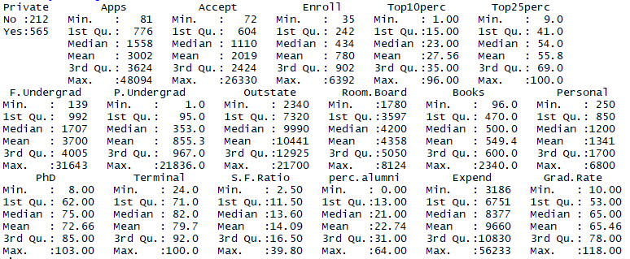
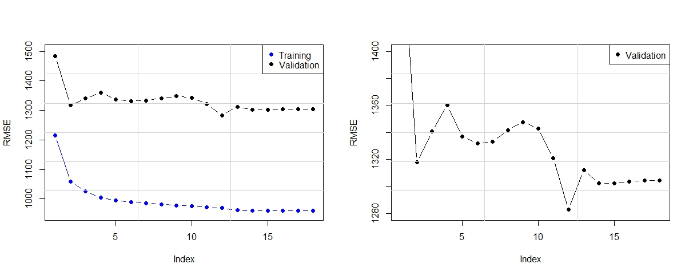
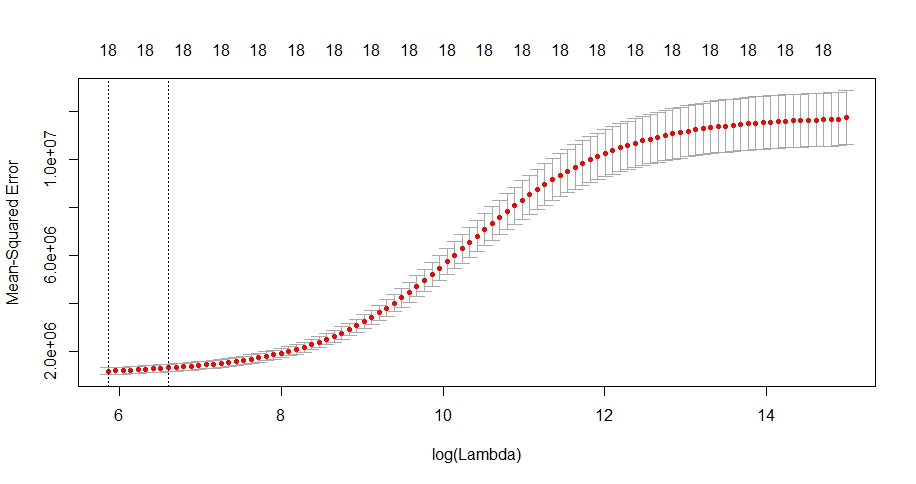
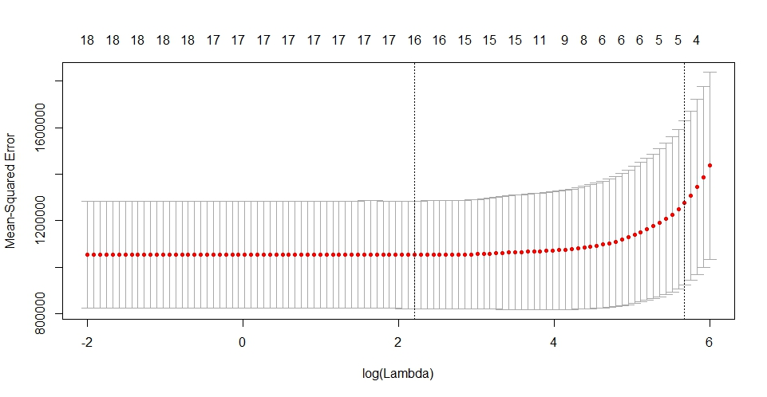

# Model Selection


_This image may not relate to this project at all. Source:_ [http://www.koreatimesus.com](http://www.koreatimesus.com)_._ All images, data and R Script can be found [here](https://github.com/vuduong191/Gitbook/tree/master/resources/MS01)

> This is a homework assignment in DSO\_530 Applied Modern Statistical Learning Methods class by professor Robertas Gabrys, USC. I completed this project with two other classmates He Liu and Kurshal Bhatia

## Prompt

The data set was taken from the StatLib data repository which is administered and maintained at Carnegie Mellon University. The data set was used in the ASA Statistical Graphics Section's Data Analysis Exposition. This data set consists of 777 observations and 19 variables:

```text
College = Name of a university
Private = A factor with levels No and Yes indicating private or public university
Apps = Number of applications received
Accept = Number of applications accepted
Enroll = Number of new students enrolled
Top10perc = Pct. new students from top 10% of H.S. class
Top25perc = Pct. new students from top 25% of H.S. class
F.Undergrad = Number of fulltime undergraduates
P.Undergrad = Number of parttime undergraduates
Outstate = Out-of-state tuition
Room.Board = Room and board costs
Books = Estimated book costs
Personal = Estimated personal spending
PhD = Pct. of faculty with Ph.D.'s
Terminal = Pct. of faculty with terminal degree
S.F.Ratio = Student/faculty ratio
perc.alumni = Pct. alumni who donate
Expend = Instructional expenditure per student
Grad.Rate = Graduation rate
```

Objective of the analysis: build a predictive model to predict the number of applications received using given features in the College data set.

## Prepare Data

```r
college <-read.csv("college.csv")
head(college)
```

The first column is just the name of each university. We don’t really want R to treat this as data. However, it may be handy to have these names for later, so we use this data as names for rows.

```r
rownames(college) <- college[,1]
college <- college[,-1]
str(college)
summary(college)
```



We are going to divide universities into two groups based on whether or not the proportion of students coming from the top 10 % of their high school classes exceeds 50 %. The decision is recorded in a dummy variable called Elite.

```r
college$Elite=rep("No",nrow(college))
college$Elite[college$Top10perc >50]=" Yes"
college$Elite=as.factor(college$Elite)
# Change the Private and Elite into dummy variables
college$Elite = as.numeric(as.numeric(college$Elite)==1)
college$Private= as.numeric(as.numeric(college$Private)==2)
```

Let's create a training set and a testing set

```r
set.seed(1)
test_id<-sample(dim(college)[1],200)
y.train=college[-(test_id),2]
x.train=college[-(test_id),-2]
y.test=college[(test_id),2]
x.test=college[(test_id),-2]
test=college[test_id,]
train=college[-(test_id),]
```

To evaluate models predictive accuracy, we create functions for RMSE and MAPE for convenient calls later. We can also inclue other measures of error like CV.

```r
RMSE=function(y,y.hat) sqrt(mean((y-y.hat)^2))
MAPE=function(y,y.hat) mean(abs((y-y.hat)/y))
```

We also make an RMSE report table and a time consumtion report table for easy view and comparison.

```r
time_consumed <-data.frame(NA,NA,NA,NA,NA,NA,NA,NA,NA)
colnames(time_consumed) <- c("Sub_Ex", "Sub_For", "Sub_Back","Linear Reg","Ridge","Lasso","PCR","PLS","Elastic Net")
rmse_comparison <-data.frame(NA,NA,NA,NA,NA,NA,NA,NA,NA)
colnames(rmse_comparison) <- c("Sub_Ex", "Sub_For", "Sub_Back","Linear Reg","Ridge","Lasso","PCR","PLS","Elastic Net")
```

## Best Subset regression

We will now use the package leaps to evaluate all the best-subset models. We try 3 subset selection approaches "exhaustive", "backward",and "forward".

### Exhaustive approach

We will wrap our code in a pair of time record to calculate the time consumption.

```r
library(leaps)
starting.time=Sys.time()
M.ex=regsubsets(Apps~.,data=train,nvmax=18,really.big=T)
finishing.time=Sys.time()
time_consumed[1,1]=round(finishing.time-starting.time,4)
which.max(summary(M.ex)$adjr2)
plot(summary(M.ex)$adjr2, xlab = "Number of Variables", ylab = "Adjusted R Square")
points(14, summary(M.ex)$adjr2[14], pch = 20, col = "red")
```

R-squared Adjusted is smallest in case of 14 variable model when we train the model. Besides R-squared Adjusted, we can use AIC or BIC as the parameters to choose models. We now use the models generated from the training set to make prediction on testing set, and record the erros for each model. There're 18 models.

```r
M.ex.accuracy <- data.frame(rep(NA,18),rep("",18),rep(NA,18),rep("",18),rep(NA,18),rep("",18),rep(NA,18),rep("",18),rep(NA,18),rep("",18),rep(NA,18),rep("",18), stringsAsFactors = FALSE)
colnames(M.ex.accuracy)=c("Train.RMSE","","Test.RMSE","","Train.MAPE","","Test.MAPE","","Train.Corr","","Test.Corr","")
for (i in 1:18) {
  M.ex.y.hat<-t(coef(M.ex,id=i)) %*% t(cbind(1,x.test[,names(coef(M.ex,id=i))[-1]]));
  M.ex.fitted<-t(coef(M.ex,id=i)) %*% t(cbind(1,x.train[,names(coef(M.ex,id=i))[-1]]));  
  M.ex.accuracy$Train.RMSE[i] = RMSE(y=y.train,y.hat=M.ex.fitted);
  M.ex.accuracy$Test.RMSE[i] = RMSE(y=y.test,y.hat=M.ex.y.hat);
  M.ex.accuracy$Train.MAPE[i] = MAPE(y=y.train,y.hat=M.ex.fitted);
  M.ex.accuracy$Test.MAPE[i] = MAPE(y=y.test,y.hat=M.ex.y.hat);
  M.ex.accuracy$Train.Corr[i] = cor(as.vector(M.ex.fitted),y.train);
  M.ex.accuracy$Test.Corr[i] = cor(as.vector(M.ex.y.hat),y.test)
}

for (i in 1:3){
  M.ex.accuracy[match(sort(M.ex.accuracy$Train.RMSE)[i],M.ex.accuracy$Train.RMSE),2]=paste(replicate(4-i, '*'), collapse = "");
  M.ex.accuracy[match(sort(M.ex.accuracy$Test.RMSE)[i],M.ex.accuracy$Test.RMSE),4]=paste(replicate(4-i, '*'), collapse = "");
  M.ex.accuracy[match(sort(M.ex.accuracy$Train.MAPE)[i],M.ex.accuracy$Train.MAPE),6]=paste(replicate(4-i, '*'), collapse = "");
  M.ex.accuracy[match(sort(M.ex.accuracy$Test.MAPE)[i],M.ex.accuracy$Test.MAPE),8]=paste(replicate(4-i, '*'), collapse = "");
  M.ex.accuracy[match(sort(M.ex.accuracy$Train.Corr)[19-i],M.ex.accuracy$Train.Corr),10]=paste(replicate(4-i, '*'), collapse = "");
  M.ex.accuracy[match(sort(M.ex.accuracy$Test.Corr)[19-i],M.ex.accuracy$Test.Corr),12]=paste(replicate(4-i, '*'), collapse = "");  
}
M.ex.accuracy
```

The summary table is now like this:

```r
> M.ex.accuracy
   Train.RMSE     Test.RMSE     Train.MAPE     Test.MAPE     Train.Corr     Test.Corr    
1   1215.3447      1483.424      0.2642744 *** 0.2725806      0.9350495     0.9576987    
2   1058.5431      1317.831      0.3685517     0.3191913      0.9511341     0.9676984    
3   1021.3586      1353.455      0.2657766  ** 0.2359127 ***  0.9545873     0.9647422    
4   1003.9375      1360.159      0.3691235     0.3429179      0.9561585     0.9662017    
5    995.3905      1336.878      0.3656009     0.3226051      0.9569186     0.9670741    
6    989.8745      1331.956      0.3353175     0.2854917      0.9574053     0.9672007    
7    985.2096      1353.994      0.3190749   * 0.2886800      0.9578147     0.9668531    
8    978.2238      1327.493      0.3266173     0.2771585      0.9584237     0.9678347    
9    972.3983      1344.641      0.3454567     0.2642254      0.9589280     0.9673834    
10   969.0885      1346.711      0.3416160     0.2776933      0.9592131     0.9671804    
11   965.3341      1313.723      0.3472304     0.2778655      0.9595351     0.9691684    
12   962.6936      1316.779      0.3443276     0.2567660  **  0.9597609     0.9689705    
13   961.1050      1312.251      0.3471107     0.2602167      0.9598963     0.9691584    
14   960.1505      1302.293  **  0.3472487     0.2583202   *  0.9599776     0.9697018 ***
15   959.4776      1302.273 ***  0.3470724     0.2644870      0.9600348     0.9696671  **
16   959.2712   *  1303.679   *  0.3480086     0.2657612      0.9600524   * 0.9696123   *
17   959.2130  **  1304.623      0.3475276     0.2676477      0.9600573  ** 0.9695919    
18   959.2129 ***  1304.605      0.3475254     0.2676874      0.9600573 *** 0.9695929
```

RMSE for testing set is min in 15 variable model.

```r
which.min(M.ex.accuracy$Test.RMSE)
```

We conduct the same procedure for other two approaches.

### Forward approach

```r
> M.for.accuracy
   Train.RMSE     Test.RMSE     Train.MAPE     Test.MAPE     Train.Corr     Test.Corr    
1   1215.3447      1483.424      0.2642744 *** 0.2725806      0.9350495     0.9576987    
2   1058.5431      1317.831      0.3685517     0.3191913      0.9511341     0.9676984    
3   1025.6655      1340.797      0.3393837   * 0.3152921      0.9541943     0.9657877    
4   1003.9375      1360.159      0.3691235     0.3429179      0.9561585     0.9662017    
5    995.3905      1336.878      0.3656009     0.3226051      0.9569186     0.9670741    
6    989.8745      1331.956      0.3353175  ** 0.2854917      0.9574053     0.9672007    
7    985.9823      1333.205      0.3487048     0.2736176      0.9577470     0.9672856    
8    981.9279      1341.610      0.3504910     0.2723669      0.9581014     0.9672037    
9    978.1941      1347.694      0.3479662     0.2851037      0.9584263     0.9668737    
10   975.8946      1342.996      0.3587785     0.2903442      0.9586258     0.9673159    
11   970.8823      1320.889      0.3545895     0.2645969      0.9590587     0.9686026    
12   968.8510      1283.129 ***  0.3553727     0.2677575      0.9592335     0.9698657 ***
13   961.1050      1312.251      0.3471107     0.2602167  **  0.9598963     0.9691584    
14   960.1505      1302.293   *  0.3472487     0.2583202 ***  0.9599776     0.9697018  **
15   959.4776      1302.273  **  0.3470724     0.2644870   *  0.9600348     0.9696671   *
16   959.2712   *  1303.679      0.3480086     0.2657612      0.9600524   * 0.9696123    
17   959.2130  **  1304.623      0.3475276     0.2676477      0.9600573  ** 0.9695919    
18   959.2129 ***  1304.605      0.3475254     0.2676874      0.9600573 *** 0.9695929
```

R-squared Adjusted is smallest in case of 14 variable model when we train model. However, if we select model using validation set, RMSE for testing set is min in 12 variable model.

### Exhaustive approach

```r
> M.back.accuracy
   Train.RMSE     Test.RMSE     Train.MAPE     Test.MAPE     Train.Corr     Test.Corr    
1   1215.3447      1483.424      0.2642744 *** 0.2725806      0.9350495     0.9576987    
2   1058.5431      1317.831      0.3685517     0.3191913      0.9511341     0.9676984    
3   1025.6655      1340.797      0.3393837     0.3152921      0.9541943     0.9657877    
4   1003.9375      1360.159      0.3691235     0.3429179      0.9561585     0.9662017    
5    996.4307      1350.950      0.3335815     0.2990086      0.9568265     0.9664878    
6    994.3908      1384.976      0.3215884   * 0.2898493      0.9570070     0.9653612    
7    985.2096      1353.994      0.3190749  ** 0.2886800      0.9578147     0.9668531    
8    978.2238      1327.493      0.3266173     0.2771585      0.9584237     0.9678347    
9    972.3983      1344.641      0.3454567     0.2642254      0.9589280     0.9673834    
10   969.6505      1318.688      0.3373336     0.2705813      0.9591647     0.9685162    
11   965.4591      1312.280      0.3470725     0.2586248   *  0.9595244     0.9692669    
12   962.6936      1316.779      0.3443276     0.2567660 ***  0.9597609     0.9689705    
13   961.1050      1312.251      0.3471107     0.2602167      0.9598963     0.9691584    
14   960.1505      1302.293  **  0.3472487     0.2583202  **  0.9599776     0.9697018 ***
15   959.4776      1302.273 ***  0.3470724     0.2644870      0.9600348     0.9696671  **
16   959.2712   *  1303.679   *  0.3480086     0.2657612      0.9600524   * 0.9696123   *
17   959.2130  **  1304.623      0.3475276     0.2676477      0.9600573  ** 0.9695919    
18   959.2129 ***  1304.605      0.3475254     0.2676874      0.9600573 *** 0.9695929
```

R-squared Adjusted is smallest in case of 14 variable model when we train model. However, if we select model using validation set, RMSE for testing set is min in 15 variable model.

We here can compare the behavior of RMSE of testing set with that of training set \(the left chart\) and zoom in RMSE of testing set \(the right chart\) when we increase the number of explanatory variables.

### Exhaustive approach


### Forward approach



### Exhaustive approach


As we expect, the training error goes down monotonically as we add more explanatory variables, but not so for the validation error. RMSE for testing set fluctuates dynamically. Increasing the size of the model does not guarantee higher accuracy.

## OLS Regression Model - Evaluate the accuracy of the model using Cross Validation

we need function cv.glm\(\) from boot package to calculate K-fold cross-validation prediction error.

```r
library(boot)
starting.time=Sys.time()
M.linear=glm(Apps~.,data=college)
finishing.time=Sys.time()
time_consumed[1,4]=round(finishing.time-starting.time,4)

cv.error=cv.glm(college,M.linear,K=10)$delta[1]
summary(M.linear)
cv.error  # = 1262112
cv.error^.5 # = 1123.438
M.linear.y.hat=predict(M.linear,x.test)
rmse_comparison[4]<-RMSE(y=y.test,y.hat=M.linear.y.hat)
```

 **There are two potential problems with this OLS regression when we include all explanatory variables:** 1. Prediction Accuracy: When n \(number of observations\) ~ p \(number of predictors\), the least square fit can have high variance and may result in over fitting and poor estimates on unseen observations. And, when n &lt; p, then the variability of the least squares fit increases dramatically, and the variance of these estimates is infinite. 2. Model Interpretability: When we have a large number of variables X in the model, there will generally be many that have little or no effect on Y, which makes it harder to see the big picture or recognize the effect of "important variables"

\*\* A solution for this is Subset Selection, which is done at the begining of this post. We will include some more solutions below."

We can fit a model containing all p predictors using a technique that constrains or regularizes the coefficient estimates, or equivalently, that shrinks the coefficient estimates towards zero. Shrinking the coefficient estimates can significantly reduce their variance.The two best-known techniques for shrinking the regression coefficients towards zero are ridge regression and the lasso.

## Ridge Regression

We need to pick the tuning parameter lambda, and we do this by cross-validation.

```r
library(glmnet)

set.seed(1)
cv.out=cv.glmnet(as.matrix(x.train),y.train,alpha=0)
cv.out$cvsd
min(cv.out$cvsd) # = 230181.
min(cv.out$cvsd)^.5 # = 479.7724
par(mfrow=c(1,1))
plot(cv.out)

best.lambda=cv.out$lambda.min
best.lambda # = 351.804
```

Because we let the function automatically pick the range of lambda, this plot is not so useful. The variance of MSE seems to increase as lambda increases. This is unfortunately not true. If we do it again, we better set a wider range of lambda by set a variable lambdarange &lt;- \(exp\(1\)\)^seq\(10, -2, length = 100\), and use this in the function. If we did that, the range of log\(lambda\) would be from -2 to 10, instead of 6 to 14 like in the graph. We will demonstrate this in the Lasso model below.



```r
starting.time=Sys.time()
M.ridge=glmnet(as.matrix(x.train),y.train,alpha=0,lambda=best.lambda)
finishing.time=Sys.time()
time_consumed[1,5]=round(finishing.time-starting.time,4)
```

By checking the coefficients of the model, we can see some coefficients are shrinked to nearly 0.

```r
> coef(M.ridge)
19 x 1 sparse Matrix of class "dgCMatrix"
                       s0
(Intercept) -1.669029e+03
Private     -6.119370e+02
Accept       7.975664e-01
Enroll       5.218250e-01
Top10perc    1.056295e+01
Top25perc    2.583510e+00
F.Undergrad  1.116647e-01
P.Undergrad  2.887601e-02
Outstate     4.787920e-03
Room.Board   1.663263e-01
Books        1.959874e-01
Personal    -3.918161e-03
PhD         -1.728731e+00
Terminal    -2.953220e+00
S.F.Ratio    1.747877e+01
perc.alumni -9.499477e+00
Expend       7.908724e-02
Grad.Rate    1.240990e+01
Elite        6.587377e+02
```

```r
M.ridge.y.hat=predict(M.ridge,s=best.lambda,newx = mat.x[test_id,])
rmse_comparison[5]<-RMSE(y=y.test,y.hat=M.ridge.y.hat)
```

## Lasso Regression

The LASSO works in a similar way to Ridge Regression, except it uses a different penalty term. Using this penalty, it could be proven mathematically that some coefficients end up being set to exactly zero.

With LASSO, we can produce a model that has high predictive power and it is simple to interpret

```r
set.seed(1)
lambdarange <- (exp(1))^seq(6, -2, length = 100)
cv.out=cv.glmnet(as.matrix(x.train), y.train,alpha=1, lambda = lambdarange)
cv.out$cvsd
min(cv.out$cvsd) # = 229225.6
min(cv.out$cvsd)^.5 # = 478.7751
par(mfrow=c(1,1))
plot(cv.out)


best.lambda=cv.out$lambda.min
best.lambda # = 9.043264
```



```r
starting.time=Sys.time()
M.lasso=glmnet(as.matrix(x.train),y.train,alpha=1,lambda=best.lambda)
finishing.time=Sys.time()
time_consumed[1,6]=round(finishing.time-starting.time,4)
```

Looking at the coefficients of the model, we can see that some coefficients are shrinked to exactly zero.

```r
> coef(M.lasso)
19 x 1 sparse Matrix of class "dgCMatrix"
                       s0
(Intercept) -1.004706e+03
Private     -4.813969e+02
Accept       1.292032e+00
Enroll      -2.237505e-01
Top10perc    1.775103e+01
Top25perc    .           
F.Undergrad  5.653075e-02
P.Undergrad  3.715501e-02
Outstate    -3.094770e-02
Room.Board   9.904828e-02
Books        8.435703e-02
Personal     .           
PhD         -4.495032e+00
Terminal    -4.348351e+00
S.F.Ratio    2.030395e+01
perc.alumni -2.016228e+00
Expend       8.920336e-02
Grad.Rate    8.123156e+00
Elite        5.553816e+02
```

Adding the RMSE to the report table

```r
M.lasso.y.hat=predict(M.lasso,s=best.lambda,newx = mat.x[test_id,])
rmse_comparison[6]<-RMSE(y=y.test,y.hat=M.lasso.y.hat)
```

## Elastic Net

This is a dynamic blending of lasso and ridge regression.

```r
set.seed(1)
lambdarange <- (exp(1))^seq(6, -2, length = 100)
cv.out= cv.glmnet(as.matrix(x.train),y.train,alpha=.5, lambda = lambdarange)
cv.out$cvsd
min(cv.out$cvsd) #229001.9
min(cv.out$cvsd)^.5 #478.5414
plot(cv.out)
best.lambda=cv.out$lambda.min 
best.lambda # = 4.030697
```


```r
starting.time=Sys.time()
M.elastic=glmnet(mat.x[-test_id,],y.train,alpha = .5,lambda=best.lambda)
finishing.time=Sys.time()
time_consumed[1,9]=round(finishing.time-starting.time,4)
coef(M.elastic)
M.elastic.y.hat=predict(M.elastic,s=best.lambda,newx=mat.x[test_id,])
rmse_comparison[9]<-RMSE(y=y.test,y.hat=M.elastic.y.hat)
```

The methods that we have discussed so far in this post have involved fitting linear regression models, via least squares or a shrunken approach, using the original predictors, X1, X2, … , Xp.

We now explore a class of approaches that transform the predictors and then fit a least squares model using the transformed variables. We will refer to these techniques as dimension reduction methods.

## PCR Model

```r
library (pls)
set.seed(1)
starting.time=Sys.time()
M.pcr=pcr(Apps~.,data=train, scale=TRUE,validation="CV")
finishing.time=Sys.time()
time_consumed[1,7]=round(finishing.time-starting.time,4)

summary(M.pcr)
validationplot(M.pcr,val.type=c("MSEP"))
```


Based on the graph, we may pick 5 PCs to build our models because the degree of MSEs reduction is not subtantial when we increases the number of PCs from 5 to 18.

```r
M.pcr.y.hat = predict(M.pcr,x.test,ncomp = 5) 
rmse_comparison[7]<-RMSE(y=y.test,y.hat=M.pcr.y.hat)
```

## PLS Model

```r
starting.time=Sys.time()
M.pls=plsr(Apps~.,data=train, scale=TRUE,validation="CV")
finishing.time=Sys.time()
time_consumed[1,8]=round(finishing.time-starting.time,4)

summary (M.pls)
validationplot(M.pls,val.type=c("MSEP"))
```


Based on the graph, we may pick 5 PCs to build our models because the degree of MSEs reduction is not subtantial when we increases the number of PCs from 5 to 18.

```r
M.pls.y.hat= predict(M.pls,x.test,ncomp = 5) 
rmse_comparison[8]<-RMSE(y=y.test,y.hat=M.pls.y.hat)
```

## To compare the performance of all models on test set

**RMSE**

OLS regression shows the best performance, but Subset Selection with forward approach also shows impressive accuracy.

```r
> rmse_comparison
    Sub_Ex  Sub_For Sub_Back Linear Reg    Ridge    Lasso      PCR      PLS Elastic Net
1 1302.273 1283.129 1302.273   1150.511 1801.388 1345.767 2271.287 1515.119    1337.154
```

**Time Consumed**

Ridge and Lasso are most efficient.

```r
> time_consumed 
  Sub_Ex Sub_For Sub_Back Linear Reg Ridge  Lasso    PCR    PLS Elastic Net
1 0.0299  0.0519   0.1396     0.0249 0.017 0.0179 0.0908 0.1047      0.0349
```

